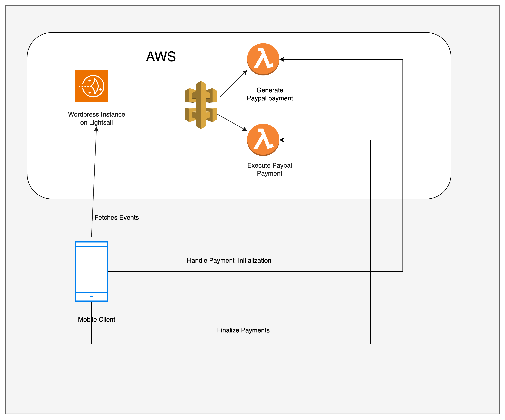

# Friends Of Bulgaria Mobile App

### Description

### Table of content

1. Prerequisites
2. Getting Started
3. Figma Design
4. Project Structure
5. Running the App
6. Testing
7. Deployment
8. Technology Used
9. Architecture Used
10. Contributing
11. License

## Prerequisites

List all the prerequisites needed to set up and run the app. Include the following, if applicable:

1. Flutter SDK: Install Flutter
2. Dart: Install Dart
3. Android Studio
4. An emulator or physical device for testing
5. AWS account

### Getting Started

Explain how to set up the development environment, install dependencies, and get the project up and running.

1. Clone the repository:
   `ssh
git clone git@github.com:OtchereDev/Friend-of-bulgaria.git
cd mobile
`
2.

### Technology Used

1. Flutter (Dart)
2. Wordpress custom post type
3. AWS (API Gateway, Lightsail, Lambda Function)

### Architecture Used

### Figma Design

[Friend Of Bulgaria Mobile Design](<https://www.figma.com/file/LeewO8I5HW3KGc4lC3KrD3/Oliver's-Portfolio-(Copy)?type=design&node-id=349-536&mode=design&t=gYHjzMVNU6ctpUX9-4>)

### Result

1. An iOS Mobile App
2. An Android Mobile App
